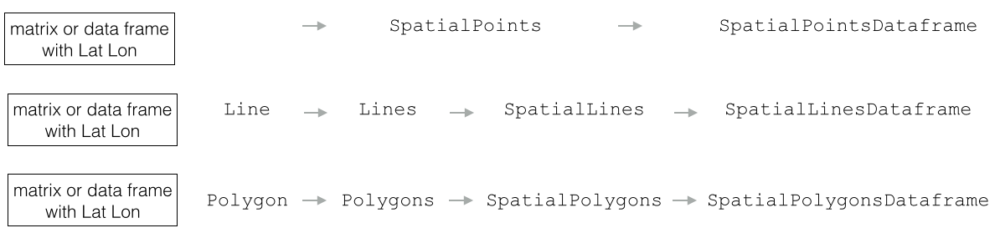

```{r knitr_init, echo=FALSE, results='hide', cache=FALSE,message=FALSE}
library(knitr)
#library(rmdformats)

## libraries needed for R code examples
library(sp)
library(raster)
library(rgdal)

## Global options
options(max.print="75")
opts_chunk$set(echo=TRUE,
	             cache=TRUE,
               prompt=FALSE,
               tidy=TRUE,
               comment=NA,
               message=FALSE,
               warning=FALSE)
opts_knit$set(width=75)

```

***

Welcome to Spatial Data in R! This tutorial is designed to provide an introduction to the two types of spatial data you will encounter in R: vector data and rasters. By the end of this tutorial, you should have a good sense of how R thinks about spatial data, and how to import and export spatial datasets you may get from other programs or sources.  
***

# 0. Set-Up
Before we start, we need to install some libraries. In this tutorial, we will work with three libraries: 

* `sp`: vector data library
* `rgdal` for importing and exporting vector data from other programs, 
* `raster` for working with raster data

### 0.1 Installing: 

__On Windows:__

Just run: 

    install.packages(c("sp","raster","rgdal"))

__On Mac:__

1. Download [GDAL complete](http://www.kyngchaos.com/files/software/frameworks/GDAL_Complete-1.11.dmg)

2. Doubleclick and install the `.dmg` file as you are used to on a Mac

3. Make sure you have R Version 3.1 installed -- if not update it.

4. Download [rgdal](http://www.kyngchaos.com/files/software/frameworks/rgdal-0.9.1-1.dmg)  

5. Doubleclick to open the `.dmg` file

6. Move `rgdal_0.9-1.tgz` to your Desktop folder

7. `install.packages("~/Desktop/rgdal_0.9-1.tgz", repos=NULL)`

8. Install `raster` and `sp` by running: `install.packages(c("sp","raster"))`

### 0.2 Check your installation: 

If everything went well, the following three commands should run without problem!

    library (sp)
    library (rgdal)
    library (raster)
    

***
# 1. Vector Data

***
## Exercise 0

Discuss with your neighbor: What do we need to specify in order to define spatial vector data?

***

## 1.1 Spatial Data in R: Building Objects from Scratch!
Almost all spatial data in R is based on the `sp` package. Even other libraries that may seem independent are usually built on top `sp`, even if you can't see it.

The `sp` package has three main types of spatial data we'll work with: points, lines, and polygons. There are some differences between these different types, but they are all very similar.

To help you understand what these data structures are like, in this section we'll create some spatial data from scratch. This is probably not how you'll work with data in the future -- most of the time you just import spatial data from a source -- but this exercise will help give you a good foundation and help you know how to troubleshoot problems in the future. 

There are three basic steps to creating spatial data by hand:  

* **Create geometric objects, either points, lines, or polygons**
* **Convert those to `Spatial*` objects (`*` stands for Points, Lines, or Polygons)**
    + Geometric objects live in an abstract space (the x-y plane). To make them *spatial* objects, we also need to include information on how those x-y coordinates relate the places in the real world using a Coordinate Reference System (CRS).

* **(_Optional_:) Add a data frame with attribute data, which will turn your `Spatial*` object into a `Spatial*DataFrame` object.**


### 1.1.1 SpatialPoints: Your First Spatial* Object!


Points are the most basic geometric shape, so we begin by building a `SpatialPoints` object by (a) . 

#### Make Points. 
We start with a random set of coordinates, then pass them to the `SpatialPoints` function to create our first `SpatialPoints` object:
```{r}
random.coordinates <- matrix(runif(20), ncol=2) # a matrix with some arbitrary points as coordinates..
xy.sp <- SpatialPoints(random.coordinates) # ..converted into a spatial object
plot(xy.sp, pch = 2)
```

To get a summary of how R sees these points, we can ask it for summary information in a couple different ways. Here's a summary of available commands:

method/class | and what it does
------------ | ----------------
`coordinates(x)` | returns a matrix with the spatial coordinates. For spatial polygons it returns the centroids.
`bbox(x)` | returns the bounding box (most extreme x and y coordinates)
`summary(x)` | an overview of the object, designed for human consumption
`str(x)` | an overview of the object as R sees it
`proj4string(x)` | sets or retrieves projection attributes using the CRS object.
`plot(x)` | plots a spatial object
`spplot(x)` | plots all the attributes unless specified otherwise


Let's try a few:

```{r}
coordinates(xy.sp)
bbox(xy.sp)
summary(xy.sp)
```

While `summary` gives you a human-readable sense of an object, `str` gives you a sense of how R sees an object, so let's take a look. If this seems to alien to you, it's not important now, just something to be aware of:

```{r}
str(xy.sp)
```


#### Add a Coordinate Reference System (CRS)

Unlike a simple geometric object, a `SpatialPoints` object has the ability to keep track of how the points is knows about relate to places in the real world through an associated "Coordinate Reference System" (CRS -- the combination of a geographic coordinate system and a projection), which is stored using a code called a `proj4string`. The proj4string is so important to a `SpatialPoints` object, that it's presented right in the summary:

```{r}
summary(xy.sp)
```

In this case, however, while our `SpatialPoints` object clearly knows what a projection *is*, the Spatial object we just created __does not__ have a projection or geographic coordinate system defined. It is ok to plot, but be aware that for any meaningful spatial operation you will need to define a CRS. 

CRS objects can be created by passing the `CRS()` function the code associated with a known projection. You can find the codes for most commonly used projections from [www.spatialreference.org](www.spatialreference.org). 

Note that the same CRS can often be called in many ways. For example, one of the most commonly used CRS is the WGS84 latitude-longitude projection. You can create a WGS84 lat-long projection object by either passing the reference code for the projection --  `CRS("+init=EPSG:4326"`) -- or by directly calling all its relevant parameters -- `CRS("+proj=longlat +ellps=WGS84 +datum=WGS84 +no_defs")`.

10. Here's an illustration of assigning a CRS:
```{r eval=FALSE}
is.projected(ph.df) # see if a projection is defined  
crs.geo <- CRS("+init=EPSG:4326")  # geographical, datum WGS84
proj4string(ph.df) <- crs.geo  # define projection system of our data
```

We'll talk more about managing projections in the next lesson. 


#### Add Attributes

Moving from a `SpatialPoints` to a `SpatialPointsDataFrame` occurs when you add a DataFrame of attributes to the points. Let's just add an arbitrary table to the data -- this will label each point with a letter and a number.   

```{r}
df <- data.frame(attr1 = LETTERS[1:10], attr2 = c(10:1))
```

```{r}
xy.spdf <- SpatialPointsDataFrame(xy.sp, df)
summary(xy.spdf)
```

Now that we have attributes, we can also subset our data the same way we would subset a DataFrame. Some subsetting:
```{r}
xy.spdf[1:2, ]        # row 1 and 2 only
plot(xy.spdf[which(xy.spdf$attr2>5),])    # select if attr2 > 5
```

***

#### SpatialPoint from a lat/lon table

A `SpatialPointsDataFrame` object can be created directly from `data.frames` by specifying which columns contain the coordinates. This is interesting, for example if you have a spreadsheet that contains latitude, longitude and some values. You an read this into a data frame with `read.table`, and then create the object from the data frame in one step by using the `coordinates()` command. That automatically turns the dataframe object into a `SpatialPointsDataFrame`.


***
#### Exercise 3

1. If you haven't already, create a new directory `R_Workshop` on your Desktop. 
2. Download and place the `sf` folder form coursework in this directory.
3. Set your working directory to  `R_Workshop`
4. Use `read.csv()` to read `sf_restaurant_inspections.csv` into a dataframe in R and name it `sf.df`.
5. Use `head()` to examine the first few lines of the dataframe.
6. Use `class()` to examine which object class the table belongs to.
7. Convert the table into a spatial object using the `coordinates` command and passing the names of the columns in the table that correspond to longitude and latitude:

    `coordinates(sf.df) <- c("longitude", "latitude")`

> Note the reverse order! While we usually say "latitude and longitude", since longitude corresponds to the x-coordinates on a map and latitude corresponds to the y-coodinates and R likes coordinates to be ordered (x,y), we pass `c("longitude","latitude")`!

8. Use `class()`again to examine which object class the table belongs to now:  
What to you observe?

9. Plot restaurants with terrible scores by subsetting on `Score`. 


***

### 1.1.2 SpatialPolygons: Your bread and butter

SpatialPolygons are very, very common, especially in political science (think administrative borders, electoral constituencies, etc.), so they're important to get used to.  

#### Building up a `SpatialPolygons` from scratch. 

`SpatialPolygons` are a little more complicated than `SpatialPoints`. With `SpatialPoints`, we moved directly from x-y coordinates to a `SpatialPoints` object. With a `SpatialPolygons` object, we have to build it up by creating `Polygon` objects, then combining those into `Polygons` objects, and finally combining those to create `SpatialPolygons`.

A `Polygon` object is a single geometric shape (e.g. a square, rectangle, etc.) defined by a single uninterrupted line around their exterior. 

A `Polygons` object consists of one *or more* simple geometric objects (`Polygon` objects) that combine to form what you think of as a single unit of analysis (an "observation"). For example, each island in Hawaii would be a `Polygon`, but Hawaii itself is the `Polygons` consisting of all the individual island `Polygon` objects. 

Finally, you can gather a collection of `Polygons` (say, one for each state) into a `SpatialPolygons` object. If you're familiar with shapefiles, `SpatialPolygons` is basically the R analogue of a `shapefile` or `layer`. 

**One special note:** if you want to put a hole in a polygon (e.g. drawing a donut, or if you wanted to draw South Africa and leave a hole in the middle for Lesotho) you do so by (a) creating a `Polygon` object for the outline, (b) creating a second `Polygon` object for the hole and passing the argument `hole=True`, and (c) combine the two into a `Polygons` object. 

Let's try building up a `SpatialPolygon`!

```{r}
# create polyon objects from coordinates. 
# Each object is a single geometric polygon defined by a bounding line. 
Sr1 <-  Polygon(cbind(c(2,4,4,1,2),c(2,3,5,4,2)))
Sr2 <-  Polygon(cbind(c(5,4,2,5),c(2,3,2,2)))
Sr3 <-  Polygon(cbind(c(4,4,5,10,4),c(5,3,2,5,5)))
Sr4 <-  Polygon(cbind(c(5,6,6,5,5),c(4,4,3,3,4)), hole = TRUE)

# create lists of polygon objects from polygon objects and unique ID
# A `Polygons` is like a single observation. 
Srs1 <-  Polygons(list(Sr1), "s1")
Srs2 <-  Polygons(list(Sr2), "s2")
Srs3 <-  Polygons(list(Sr3, Sr4), "s3/4")

# create spatial polygons object from lists
# A SpatialPolygons is like a shapefile or layer. 
SpP <-  SpatialPolygons(list(Srs1,Srs2,Srs3))
plot(SpP)
```

#### Coordinate Reference Systems
As with `SpatialPoints`, a `SpatialPolygons` doesn't actually know where it is in space until you give it a Coordinate Reference System, which you can do the same way you did with the `SpatialPoints` objects. 

```{r eval=FALSE}
is.projected(SpP) # see if a projection is defined  
crs.geo <- CRS("+init=EPSG:4326")  # geographical, datum WGS84
proj4string(SpP) <- crs.geo  # define projection system of our data
```


#### Adding Attributes to SpatialPolygon
In order to add attributes to the polygons the `row.names` of the attributes data frame are matched with the ID slots of the SpatialPolygons object, and the rows of the data frame will be re-ordered if necessary.

Make attributes:
```{r}
attr <- data.frame(attr1=1:3, attr2=3:1, row.names=c("s3/4", "s2", "s1"))
```

```{r}
attr <- data.frame(attr1=1:3, attr2=3:1, row.names=c("s3/4", "s2", "s1"))
SrDf <- SpatialPolygonsDataFrame(SpP, attr)
spplot(SrDf)
```

Let's look at its structure:
```{r}
str(SrDf)
```
Whoa. 

Note that we can access the information in the slots using the `@`. For example 
```{r}
SrDf@bbox
```

To look at the attribute table, we can call the data slot:
```{r}
SrDf@data
```

### 1.1.3 SpatialLines: Just like SpatialPolygons
`SpatialLines` objects are basically just like `SpatialPolygons`, except they're built up using `Line` objects (each a single continuous line, like each branch of a river), `Lines` objects (collection of lines that form a single unit of analysis, like all the parts of a river), to `SpatialLines` (collection of "observations", like rivers). 

### 1.1.4 Recap of Spatial* Objects
Here's a quick summary of the construction flow of SpatialObjects:




## 1.2. Importing and Exporting Spatial Data using `rgdal`

The good news is that typically we do not have to create `Spatial` family objects as tediously as we did above. It is much more common that we work with already existing spatial data, like shapefiles you download from the internet.  

In order to read those into R and turn them into `Spatial*` family objects we rely on the `rgdal` package. It provides us direct access to the powerful [GDAL library](http://gdal.org) from within R. 

We can read in and write out spatial data using:

`readOGR()` and `writeOGR()`

The parameters provided for each function varies depending on the exact spatial file type you are reading. We will take a the ESRI shapefile as an example. A shapefile - as you know - consists of various files, and R expects all those files to be in one directory. 

When reading in a shapefile, `readOGR()` expects at least the following two arguments:

    datasource name (dsn)  # the path to the folder that contains the files
                           # Note that this is a path to the folder
    layer name (layer)     # the file name without extension
                           # Note that this is not a path but just the name of the file

For example, if I have a shapefile called `Philadelphia.shp` and all its associated files (like _.dbf, .prj, .shx_) in a directory called `PH` on my desktop, and I have my working directory set to my desktop folder, my command to read this shapefile would look like this:
```
readOGR(dsn = "sf", layer = "sf_incomes")
```
or in short:
```
readOGR("sf", "sf_incomes")
```

***
####Exercise 4

1. Load the `rgdal` package.
2. Make sure your working directory is set to the `R_Workshop` folder and it contains the materials you downloaded and unzipped earlier.
3. Read `sf_income` into an object called `sf`. Make sure you understand the directory structure.
4. Examine the file, for example with `summary()`, `class()`, `str("sf", max.level = 2)`, 
5. Take a look at the column names of the attribute data with `names(sf)`
6. Take a look at the attribute data with `head(sf@data)`
7. Note that subsetting works here: `sf[sf$MdIncHH > 40000,]` 
8. Plot some attribute data: `spplot(sf, "MdIncHH")`

***

# 2. Raster Data

## 1. Creating Raster Data From Scratch

Rasters are much more compact that vectors. Because of their regular structure the coordinates do not need to be recorded for each pixel or cell in the rectangular extent. A raster has a CRS, an origin, a distance or cell size in each direction, a dimension in terms of numbers of cells, and an array of values. If necessary, the coordinates for any cell can be computed. 

Note that the `sp` library used for vector data does have some basic tools for manipulating raster data. However, the `sp` library has largely been replaced by the `raster` library we will use here, and anything one can do with the `sp` library can also be done with the `raster` library.

A raster dataset has three primary components:

* A grid, which consists of:
    + dimensions (number of rows and columns), 
    + resolution (size of sides of each cell), 
    + and extent (where the edges of the grid "are")
* A set of values associated with each cell in the grid
* Projection data about how the grid relates to the physical world

It's relatively easy to start a raster object by just defining the grid:

```{r}
basic_raster <- raster(ncol=5, nrow=10, xmn=0, xmx=5, ymn=0, ymx=10)
basic_raster
```

However, note that this raster has a grid, but no data:
```{r}
hasValues(basic_raster)
```

We add data to the raster object using the `values` function:

```{r}
values(basic_raster) <-  1:50  # Note 50 is the total number of cells in the grid. 
plot(basic_raster)
```

**Note even though a grid is a 2-dimensional object, `SpatialGridDataFrame()` looks for data that is one-dimensional,** then assigns the values in the DataFrame by (a) starting in the top left cell, then (b) moving across the row from left to right, and finally (c) moving down a row and repeating the whole process. Thus each column must be the length of the total number of cells. 


### Defining projection
To define a projection, we use the same proj4 strings as vector data, but without the intermediate step of creating a CRS object:

```{R}
projection(basic_raster) <- "+init=EPSG:4326"
```

## 2. Reading Raster data from files

The `raster` library can also read many file types on it's own. 

```{R, eval=FALSE}
raster_from_file <- raster("sf/sanfrancisconorth.dem")
plot(raster_from_file)
```

## 3. Modifying & Interrogating `raster` objects

`raster` comes with a number of tools for modifying a raster object: 

* Change resolution: `res(basic_raster) <- c(x value,y value)`
* Change number of columns: `ncol(basic_raster) <- value`
* Change number of rows: `nrow(basic_raster) <- value`

However, **be careful with these commands** -- if you change the number of columns or rows, that will necessarily change the resolution and vice versa! Moreover, **if you change the dimensions, any values associated with the data will be erased.** 

Simiarly, you can call most attributes of a raster using analogous commands:

* Resolution: `res(basic_raster)`
* Dimensions: `dim(basic_raster)`
* Max X extent: `xmax(basic_raster)`
* Values: `values(basic_raster)`
* etc. 

***
#### Exercise 1

1. Make sure your working directory is set to the `R_Workshop` folder and it contains the materials you downloaded and unzipped earlier.
2. Read in with: `raster_from_file <- raster("sf/sanfrancisconorth.dem")`
3. What is the extent of this raster?
4. What is the projection?
5. Plot the raster with: `plot(raster_from_file)`
***
