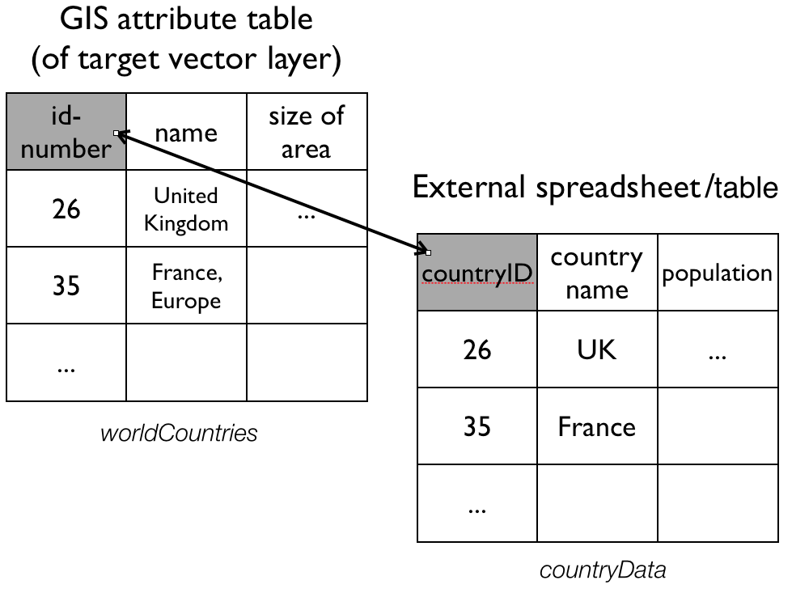
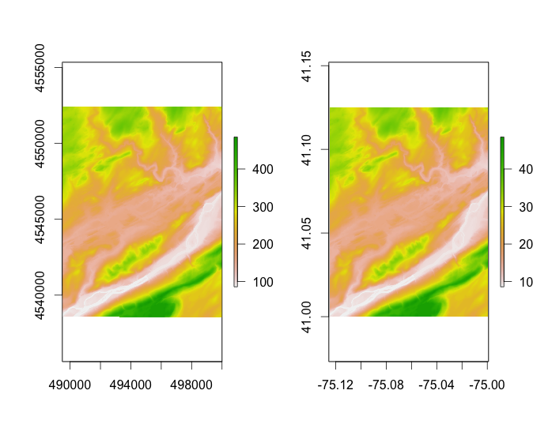

```{r knitr_init, echo=FALSE, cache=FALSE}
library(knitr)
library(rmdformats)

## Global options
options(max.print="75")
opts_chunk$set(echo=TRUE,
	             cache=TRUE,
               prompt=FALSE,
               tidy=TRUE,
               comment=NA,
               message=FALSE,
               warning=FALSE)
opts_knit$set(width=75)
```

***

In this section we will look at some libraries and commands that allow us to process spatial data in R and perform some common operations.

Before we start, please make sure you have the `dplyr`, `sp`, `rgdal` installed. For `rgdal` installation inststructions refer to [this earlier notebook](http://rpubs.com/cengel248/56015).


# 1. Attribute Join

An attribute join brings tabular data into a geographic context. It refers to the process of joining data in tabular format to data in a format that holds the geometries (polygon, line, or point). 

If you have done attribute joins of shapefiles in GIS software like _ArcGIS_ or _QGis_ you know that you need a __unique identifier__ in both the attribute table of the shapefile and the table to be joined. 

In order to combine a `Spatial*Dataframe` with another table (whic would be a dataframe in R) we do exactly the same. We have a `Spatial*Dataframe`[^1] that contains the geometries and an identifying index variable. We combine it with a dataframe, that includes the same index variable with additional variables.



To do this we will use `left_join` from the [`dplyr`](http://cran.rstudio.com/web/packages/dplyr/vignettes/introduction.html) package mentioned earlier. 

Assume we have:

* a `SpatialPolygonObject` named _worldCountries_, and
* a dataframe called _countryData_ with the attribute data to join

where:

* _"id-number"_ is the colum that contains the unique identifier in _worldCountries_, and 
* _"countryID"_ is the column that contains the unique identifier in _countryData_. 

We would then say:

```{r eval=FALSE, tidy=FALSE}
worldCountries@data <- left_join(worldCountries@data, countryData, by = c("id-number" = "countryID"))
```

By default, the `left_join()` command will conveniently detect columns of the same name and do the join on those columns. So if we had a column in each of these objects with the __same name__, that contains the unique identifier, we could simply say:

```{r eval=FALSE}
worldCountries@data <- left_join(worldCountries@data, countryData)
```

You may prefer that over this slightly more involved alternative:
```
worldCountries@data <- data.frame(worldCountries@data, countryData[match(worldCountries@data[,id-number], countryData[,countryID]),])
```
 
***
### Exercise 1

#. If you haven't already, create a directory `R_Workshop` on your Desktop. 

#. Set `R_Workshop` as your working directory in R Studio (Session > Set Working Directory > Choose Directory..).

  #. Download and unzip [`RSpatialDataOps.zip`](https://www.dropbox.com/s/nrc89agtiiwf0m3/RSpatialDataOps.zip?dl=1) in this directory.

#. Load the `rgdal`, `sp`, and `dplyr` packages.

#. Read the `PhillyTotalPopHHinc` shapefile into an object named `philly`.

#. Load the CSV table `PhillyEducAttainment.csv` into a dataframe in R and name it `education`.

#. Check out the column names of `philly` and and of `education` to determine which one might contain the unique identifier for the join. Hint: use the `names()` command. (If you are interested in what those data are, you can take a look at the codebook _PhillyEducAttainment_nhgis2010_tract_codebook.txt_)

#. Join the `education` data frame with `philly` using `left_join` as described above. Use the `names()` command to see if the join was successful.

#. Now we could plot one of the variables we just joined - but be aware that a choropleth map of the total number of the female population per census tract with a Bachelor's degree is rather meaningless. 

```{r eval=FALSE}
spplot (philly, "JN9E032")
```

***

[^1]: Per the [ESRI specification](http://www.esri.com/library/whitepapers/pdfs/shapefile.pdf) a shapefile always has an attribute table, so when we read it into R with the `readOGR` command from the `sp` package it automatically becomes a `Spatial*Dataframe` and the attribute table becomes the dataframe.


# 2. Reprojecting
Not unfrequently you may have to reproject spatial objects that you perhaps have acquired from differnet sources and that you need to be in the same Coordinate Reference System (CRS). The `sp` package has a function called `spTransform()` that will do this for you. The function takes as a minimum the following two arguments:

* the `Spatial*` object to reproject
* a CRS object with the new projection definition

If for, example, we have an object called `MyCity` and we want to reproject this into a new projection `MyNewProjection`, we would say:

```{r eval=FALSE}
MyNewProjection <- CRS("definition of projection goes here as string")
spTransform(MyCity, MyNewProjection)
```

The perhaps trickiest part here is to determine the definition of the projection string, which needs to be a string in [proj4](http://trac.osgeo.org/proj/) format. You can [look it up online](http://www.spatialreference.org). For example for [UTM zone 33N (EPSG:32633)](http://spatialreference.org/ref/epsg/wgs-84-utm-zone-33n/) the string would be:

[`+proj=utm +zone=33 +ellps=WGS84 +datum=WGS84 +units=m +no_defs`](http://spatialreference.org/ref/epsg/wgs-84-utm-zone-33n/proj4js/)

Note that you can also retrieve the CRS from an existing `Spatial*` object with the `proj4string()` command. 

***

### Exercise 2

#. From the files downaloaded earlier read the `PhillyHomicides` shapefile into R and name it `ph.hom`.

#. What is the CRS of `philly`?   What is the CRS of `ph.hom`?

#. Reproject `ph.hom` so it matches the projection of `philly` and assign it to a new object called `ph.hom.aea`.

#. You can use the `range()` command from the R base package to compare the coordinates before and after repojection and confirm that you actually have transformed them. `range()` simply returns the _min_ and _max_ value of a vector of numbers that you give it. So you can check with:  
`range(coordinates(ph.hom))`  
and  
`range(coordinates(ph.hom.aea))`  

#. You can also compare them visually with:  
```
par(mfrow=c(1,2)) 
plot(ph.hom, axes=TRUE)
plot(ph.hom.aea, axes=TRUE)
```

You should see something like:


***

In order to reproject a raster, including `SpatialGridDataFrame` objects, you will want to use the `projectRaster()` command from the `raster` package[^2]. 

[^2]: This has to do with the fact that a `SpatialGridDataFrame` is based on regularly spaced points. Since reprojection will typically not result in regularly spaced points as after transformation, as it will coerce it into a `SpatialPointsDataFrame`. It is possible but laborious to convert this back into a raster, as some interpolation needs to happen to turn unevently distributed points back into evenly disctibuted grid of points. If you need to you can convert a `SpatialGridDataFrame` to a `raster` with the `raster()` command.

Here is what it would look like to reproject the [DEM](https://www.dropbox.com/s/7e62gkbajfcabh9/DEM_10m.zip?dl=1) downloaded earlier to WGS84.

```{r eval=FALSE, tidy=FALSE}
dem.r <- raster("DEM_10m/bushkill_pa.dem")
dem.WGS84 <- projectRaster(dem.r, crs="+proj=longlat +ellps=WGS84 +datum=WGS84 +no_defs")
plot(dem.r); plot(dem.WGS84)
```



# 3. Spatial join: Points in Polygons

Spatial joins are frequent topological operations. For the next exercise we want to count all the homicides for each census tract in Philadelphia. To achieve this this we join the points of homicide incidence to the census tract polygon. You might be familiar with this operation from other GIS packages.

In R will use the `aggregate()` function from the `sp` package[^3]. Here are our parameters:

* the `SpatialPointDataframe`, 
* the `SpatialPolygonDataframe` to use for spatial aggregation and  
* a function to use to aggregate. If we are just interested in counting the points, we can use `length` (of the respective vectors of the aggregated data). 

***
### Exercise 3

#. Our points are _ph.hom.aea_ and our polygons are _philly_. The points file has many attribute data (check with `names()`), and we only really need one of those columns to add it up to the count. We choose here _"DC_DIST"_, but you could choose any other one and it will give the same result. So in order to aggregate we say:
```
hom.cnt <- aggregate(x = ph.hom.aea["DC_DIST"], by = philly, FUN = length)
```
(Try this for fun:  
`hom.cnt1 <- aggregate(x = ph.hom["DC_DIST"], by = philly, FUN = length)`  
and see what happens.)

#. Now let us investigate the object we created.
```
class(hom.cnt)
names(hom.cnt)
spplot(hom.cnt)
```

***

[^3]: There is also an `aggregate()` function in the `stats` package that comes with the R standard install. Note that `sp` extends this function so it can take `Spatial*` objects and aggregate over the geometric features.


# 4. Select Polygons by Location

NOTE: For the following example we will need to make use of another library, called `rgeos`. 

```{r eval=FALSE}
install.packages("rgeos")
```
works for Windows, and perhaps for Mac. If not, see [here](http://dyerlab.bio.vcu.edu/2015/03/31/install-rgeos-on-osx/).

Our goal is to select all Philadelphia census tracts that fall within a range of 2 kilometers from the city center.

> Think about this for a moment -- what might be the steps you'd follow?

Here is one, but not the only way to do this.

#. Get the polygons
#. Find the city center coordinates
#. Create a buffer around the center
#. Select all polys that fall in the buffer


### Exercise 4

#. Get the polygons.  
Got those.  
We will reuse `philly` for the census tract polygons.

#. Find the city center coordinates.  
Ok. I will tell you: Lat is 39.95258 and Lon is -75.16522. (There also is a convenient `geocode()` function in the `ggmap` package. We will deal with that package in the next section.)  
With this information, create a `SpatialPoints` object named `ph.ctr`.  

#. Create a buffer around the center.  
Here is where we will use the `gBuffer()` function from the `rgeos` package. The function can take a number of arguments, but for this purpose we will only need two: the __sp object__ and the __width__ of the buffer, which is assumed to be in map units. The function returns a `SpatialPolygons` object to you with the buffer - name it `ph.buf`.  
So your command would look something like  
```
ph.buf <- gBuffer(the_spatial_point_object, width = a_number_here)
```  
Now -- __before you create this buffer__, think about what you might need to do to `ph.ctr` before you proceed.

#. Select all polys that fall in the buffer.  
We will use the `gIntersects()` function from the `rgeos` package for this. The function tests if two geometries (let's name them _spgeom1_ and _spgeom2_) have points in common or not. `gIntersects` returns TRUE if _spgeom1_ and _spgeom2_ have at least one point in common.  
Here is where we determine if the census tracts fall within the buffer. In addition to our two sp objects (`ph.buf` and `philly`) we need to provide one mor argument, `byid`. It is a logical vector determining if the function should be applied across ids (TRUE) or the entire object (FALSE) for _spgeom1_ and _spgeom2_. The default setting is FALSE. Since we want to compare every single census tract polygon in our `philly` object we need to set it to TRUE.  
So your command would be    
```
ph.buf.intersects <- gIntersects (ph.buf, philly, byid=TRUE)
```  
Now we can use the values returned by this function to select the polygons. (Note that `gIntersects()` returns a matrix, and we need a vector for the subsetting, so we can simply use `as.vector()` to coerce the matrix into a vector.)  
`philly.selection <- philly[as.vector(ph.buf.intersects),]`

#. Look at it:  
```
plot (philly, border="#aaaaaa")
plot (philly.selection, add=T, col="red") 
plot (ph.buf, add=T, lwd = 2)
```

***

Here is the code:

```{r eval=FALSE}
library(rgeos)

ctr.coords <- data.frame(x = -75.16522, y = 39.95258) # set the coordinates
prj <- CRS("+proj=longlat +ellps=WGS84 +datum=WGS84 +no_defs") # set the projection
ph.ctr <- SpatialPoints(ctr.coords, proj4string = prj) # create the spatialPoints

ph.ctr.aea <- spTransform(ph.ctr, philly@proj4string) # reproject!!

ph.buf <- gBuffer(ph.ctr.aea, width=2000)  # create buffer around center

ph.buf.intersects <-  gIntersects (ph.buf, philly, byid=TRUE) # determine which census tracts intersect with the buffer

philly.selection <- philly[as.vector(ph.buf.intersects),]

plot (philly, border="#aaaaaa")
plot (philly.selection, add=T, col="red") 
plot (ph.buf, add=T, lwd = 2)

````


