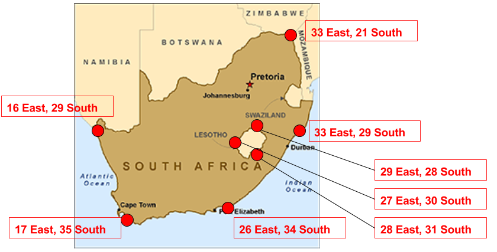

```{r, knitr_init, echo=FALSE, results='hide', cache=FALSE,message=FALSE}
library(knitr)
#library(rmdformats)

## libraries needed for R code examples
library(sp)
library(raster)
library(rgdal)

## Global options
options(max.print="75")
opts_chunk$set(echo=TRUE,
	             cache=TRUE,
               prompt=FALSE,
               tidy=TRUE,
               comment=NA,
               message=FALSE,
               warning=FALSE)
opts_knit$set(width=75)

```

***

Welcome to Spatial Data in R! This first set of tutorials (in three parts) is designed to provide an introduction to the two types of spatial data you will encounter in R: vector data and rasters. By the end of this tutorial, you should have a good sense of how R thinks about spatial data, and how to import and export spatial datasets you may get from other programs or sources.


***


## 1 Spatial Data in R: Building Objects from Scratch!
Almost all spatial vector data structures in R are based on the `sp` package. Even other libraries that may seem independent are usually built on top `sp`, even if you can't see it.

The `sp` package has three main types of spatial data we'll work with: points, lines, and polygons. There are some differences between these different types, but they are all very similar.

To help you understand what these data structures are like, in this section we'll create some spatial data from scratch. This is probably not how you'll work with data in the future -- most of the time you just import spatial data from a source -- but this exercise will help give you a good foundation and help you know how to troubleshoot problems in the future. 

There are three basic steps to creating spatial data by hand:  

* **Create geometric objects (points, lines, or polygons)**
* **Convert those geometric objects to `Spatial*` objects (`*` stands for Points, Lines, or Polygons)**
    + Geometric objects live in an abstract space (the x-y plane). To make them *spatial* objects, we also need to include information on how those x-y coordinates relate the places in the real world using a Coordinate Reference System (CRS).

* **(_Optional_:) Add a data frame with attribute data, which will turn your `Spatial*` object into a `Spatial*DataFrame` object.**

*** 

**Exercise 0**

Discuss with your neighbor: What do we need to specify in order to define spatial vector data?

***

### 1.1 SpatialPoints: Your First Spatial* Object!


Points are the most basic geometric shape, so we begin by building a `SpatialPoints` object. 

#### Make Points. 
A points is defined by a pair of x-y coordiantes, so we can create a set of points by (a) creating  matrix of x-y points, and (b) passing them to the `SpatialPoints` function to create our first `SpatialPoints` object:

```{r}
toy.coordinates <- cbind(
                    c(1.5,2.5,0.5,1,1.5,2,2.5,3,3.5), 
                    c(2,2,0.5,0.25,0,0,0,0.25,0.5)) # a matrix with some "arbitrary"" points
toy.coordinates
xy.sp <- SpatialPoints(toy.coordinates) # ..converted into a spatial object
plot(xy.sp, pch = 2)
```

To get a summary of how R sees these points, we can ask it for summary information in a couple different ways. Here's a summary of available commands:

method/class | and what it does
------------ | ----------------
`coordinates(x)` | returns a matrix with the spatial coordinates. For spatial polygons it returns the centroids.
`bbox(x)` | returns the bounding box (most extreme x and y coordinates)
`summary(x)` | an overview of the object, designed for human consumption
`str(x)` | an overview of the object as R sees it
`proj4string(x)` | sets or retrieves projection attributes using the CRS object.
`plot(x)` | plots a spatial object
`spplot(x)` | plots all the attributes unless specified otherwise


Let's try a few:

```{r}
coordinates(xy.sp)
bbox(xy.sp)
summary(xy.sp)
```

**`xy.sp` as an Object**

While `summary` gives you a human-readable sense of an object, `str` gives you a sense of how R sees an object, so let's take a look. If this seems to alien to you, don't worry, it's not crucial to understand:

```{r}
str(xy.sp)
```

What this shows is that `xy.sp` is actually a collection of different things, referred to in R as "slots": `coords`, `bbox`, and `proj4string`. (If you are used to working in another object-oriented language like Java or Python, these are analogous to attributes.) You can access each of these "slots" using the `@` operator:

```{r}
xy.sp@coords
```


#### Add a Coordinate Reference System (CRS)

Unlike a simple geometric object, a `SpatialPoints` object has the ability to keep track of how the coordinates of its points relate to places in the real world through an associated "Coordinate Reference System" (CRS -- the combination of a geographic coordinate system and a projection), which is stored using a code called a `proj4string`. The proj4string is so important to a `SpatialPoints` object, that it's presented right in the summary:

```{r}
summary(xy.sp)
```

In this case, however, while our `SpatialPoints` object clearly knows what a CRS *is*, the Spatial object we just created __does not__ have a projection or geographic coordinate system defined. It is ok to plot, but be aware that for any meaningful spatial operation you will need to define a CRS. 

CRS objects can be created by passing the `CRS()` function the code associated with a known projection. You can find the codes for most commonly used projections from [www.spatialreference.org](www.spatialreference.org). 

Note that the same CRS can often be called in many ways. For example, one of the most commonly used CRS is the WGS84 latitude-longitude projection. You can create a WGS84 lat-long projection object by either passing the reference code for the projection --  `CRS("+init=EPSG:4326"`) -- or by directly calling all its relevant parameters -- `CRS("+proj=longlat +ellps=WGS84 +datum=WGS84 +no_defs")`.

Here's an illustration of assigning a CRS:

```{r}
is.projected(xy.sp) # see if a projection is defined. 
  # Returns `NA` if no geographic coordinate system or projection; returns FALSE if has geographic coordinate system but no projection.

crs.geo <- CRS("+init=EPSG:32633")  # UTM 33N
proj4string(xy.sp) <- crs.geo  # define projection system of our data
is.projected(xy.sp)
```

We'll talk more about managing projections in the next lesson. 


#### Add Attributes

Moving from a `SpatialPoints` to a `SpatialPointsDataFrame` occurs when you add a DataFrame of attributes to the points. Let's just add an arbitrary table to the data -- this will label each point with a letter and a number. **Note points will merge with the DataFrame based on the order of observations.** 

```{r}
df <- data.frame(attr1 = LETTERS[1:9], attr2 = c(9:1))
df
```

```{r}
xy.spdf <- SpatialPointsDataFrame(xy.sp, df)
summary(xy.spdf)
```

Now that we have attributes, we can also subset our data the same way we would subset a DataFrame. Some subsetting:
```{r}
xy.spdf[1:2, ]        # row 1 and 2 only
plot(xy.spdf[which(xy.spdf$attr2>5),])    # select if attr2 > 5
```

***

#### SpatialPoint from a lat/lon table

A `SpatialPointsDataFrame` object can be created directly from a DataFrame by specifying which columns contain the coordinates. This is interesting, for example if you have a spreadsheet that contains latitude, longitude and some values. You can read this into a data frame with `read.table`, and then create the object from the data frame in one step by using the `coordinates()` command. That automatically turns the dataframe object into a `SpatialPointsDataFrame`.

***
#### Exercise 1.1

1. If you haven't already, create a new directory `R_Workshop` on your Desktop. 
2. Download and place the `RGIS1_Data` folder from coursework in this directory.
4. Use `read.csv()` to read `sf_restaurant_inspections.csv` into a dataframe in R and name it `sf.df`.
5. Use `head()` to examine the first few lines of the dataframe.
6. Use `class()` to examine which object class the table belongs to.
7. Convert the table into a spatial object using the `coordinates` command and passing the names of the columns in the table that correspond to longitude and latitude:

    `coordinates(sf.df) <- c("longitude", "latitude")`

**Note the reverse order! While we usually say "latitude and longitude", since longitude corresponds to the x-coordinates on a map and latitude corresponds to the y-coodinates and R likes coordinates to be ordered (x,y), we pass `c("longitude","latitude")`!**

8. Use `class()`again to examine which object class the table belongs to now:  
What to you observe?

9. Plot restaurants with terrible scores by subsetting on `Score`. 


***

### 1.2 SpatialPolygons: Your bread and butter

SpatialPolygons are very, very common, especially in political science (think administrative borders, electoral constituencies, etc.), so they're important to get used to.  

#### Building up a `SpatialPolygons` from scratch. 

`SpatialPolygons` are a little more complicated than `SpatialPoints`. With `SpatialPoints`, we moved directly from x-y coordinates to a `SpatialPoints` object. 

To get a `SpatialPolygons` object, we have to build it up by (a) creating `Polygon` objects, (b) combining those into `Polygons` objects (note the "s" at the end), and finally (c) combining those to create `SpatialPolygons`. So what are these components?

* A `Polygon` object is a single geometric shape (e.g. a square, rectangle, etc.) defined by a single uninterrupted line around the exterior of the shape. 
* A `Polygons` object consists of one *or more* simple geometric objects (`Polygon` objects) that combine to form what you think of as a single unit of analysis (an "observation"). For example, each island in Hawaii would be a `Polygon`, but Hawaii itself is the `Polygons` consisting of all the individual island `Polygon` objects. 
* A `SpatialPolygons` object is a collectino of `Polygons` objects, where each `Polygons` object is an "observation". For example, if we wanted a map of US states, we would make a `Polygons` object for each state, then combine them all into a single `SpatialPolygons`. If you're familiar with shapefiles, `SpatialPolygons` is basically the R analogue of a `shapefile` or `layer`. 

**One special note:** if you want to put a hole in a polygon (e.g. drawing a donut, or if you wanted to draw South Africa and leave a hole in the middle for Lesotho) you do so by (a) creating a `Polygon` object for the outline, (b) creating a second `Polygon` object for the hole and passing the argument `hole=True`, and (c) combine the two into a `Polygons` object. 

Let's try building up a `SpatialPolygon`!

```{r}
# create polyon objects from coordinates. 
# Each object is a single geometric polygon defined by a bounding line. 
house1 <-  Polygon(cbind(c(1,2,2,1),c(1,1,0,0)))
house1.roof <- Polygon(cbind(c(1,1.5,2),c(1,2,1)))
house2 <-  Polygon(cbind(c(3,4,4,3),c(1,1,0,0)))
house2.roof <- Polygon(cbind(c(3,3.5,4), c(1,2,1)))
house2.door <-  Polygon(cbind(c(3.25,3.75,3.75,3.25),c(0.75,0.75,0,0)), hole=TRUE)

# create lists of polygon objects from polygon objects and unique ID
# A `Polygons` is like a single observation. 
h1 <-  Polygons(list(house1, house1.roof), "house1")
h2 <-  Polygons(list(house2, house2.roof, house2.door), "house2")

# create spatial polygons object from lists
# A SpatialPolygons is like a shapefile or layer. 
houses <-  SpatialPolygons(list(h1,h2))
plot(houses)
```

#### Adding Attributes to SpatialPolygon
As with SpatialPoints, we can associated a DataFrame with SpatialPolygons. There are two things that are important about doing this with SpatialPolygons:

1. When you **first** associate a DataFrame to with a SpatialPolygons, R will line up rows and polygons by matching `Polygons` object names with the DataFrame `row.names`. 
2. After the initial association, this relationship is **NO LONGER** based on row.names! For the rest of the `SpatialPolygonsDataFrame`'s life, the association between `Polygons` and rows of your DataFrame is based on the order of rows in your DataFrame, so don't change the order of the DataFrame by hand!

Make attributes and plot. Note how the door -- which we created with `hole=TRUE` is empty!
```{r}
attr <- data.frame(attr1=1:2, attr2=6:5, row.names=c("house1", "house2"))
```

```{r}
houses.DF <- SpatialPolygonsDataFrame(houses, attr)
spplot(houses.DF)
```

To look at the attribute table, we can call the data slot:
```{r}
houses.DF@data
```

#### Adding a Coordinate Reference Systems (CRS)
As with `SpatialPoints`, a `SpatialPolygons` doesn't actually know where it is in space until you give it a Coordinate Reference System, which you can do the same way you did with the `SpatialPoints` objects. 

```{r eval=FALSE}
is.projected(SpP) # see if a projection is defined  
crs.geo <- CRS("+init=EPSG:4326")  # geographical, datum WGS84
proj4string(SpP) <- crs.geo  # define projection system of our data
```

***

**Exercise 1.2**
*Answer code at end of exercise -- but don't cheat!*

1. Make a (highly stylized) SpatialPolygon object for South African and Lesotho based on the following points:



2. Add an attribute Table with each country's GDP Per Capita (approximately $7,000 for South Africa and $1,000 for Lesotho).

3. Plot your SpatialPolygons using `spplot()`

***

### 1.3 SpatialLines: Just like SpatialPolygons
`SpatialLines` objects are basically like `SpatialPolygons`, except they're built up using `Line` objects (each a single continuous line, like each branch of a river), `Lines` objects (collection of lines that form a single unit of analysis, like all the parts of a river), to `SpatialLines` (collection of "observations", like rivers). 

### 1.4 Recap of Spatial* Objects
Here's a quick summary of the construction flow of SpatialObjects:


## 2. Importing and Exporting Spatial Data using `rgdal`

Normally we do not create `Spatial*` objects by hand. It is much more common to work with existing data, like shapefiles, for external sources. 

In order to read those into R and turn them into `Spatial*` family objects we rely on the `rgdal` package. It provides us direct access to the powerful [GDAL library](http://gdal.org) from within R. 

We can read in and write out spatial data using:

`readOGR()` and `writeOGR()`

The parameters provided for each function varies depending on the exact spatial file type you are reading. We will take a the ESRI shapefile as an example. A shapefile - as you know - consists of various files, and R expects all those files to be in one directory. 

When reading in a shapefile, `readOGR()` expects at least the following two arguments:

    datasource name (dsn)  # the path to the folder that contains the files
                           # Note that this is a path to the folder
    layer name (layer)     # the file name without extension
                           # Note that this is not a path but just the name of the file

For example, if I have a shapefile called `Philadelphia.shp` and all its associated files (like _.dbf, .prj, .shx_) in a directory called `PH` on my desktop, and I have my working directory set to my desktop folder, my command to read this shapefile would look like this:
```
readOGR(dsn = "sf", layer = "sf_incomes")
```
or in short:
```
readOGR("sf", "sf_incomes")
```

***
### Exercise 2

1. Load the `rgdal` package.
2. Make sure your working directory is set to the `R_Workshop` folder and it contains the materials you downloaded and unzipped earlier.
3. Read `sf_income` into an object called `sf`. Make sure you understand the directory structure.
4. Examine the file, for example with `summary()`, `class()`, `str("sf", max.level = 2)`, 
5. Take a look at the column names of the attribute data with `names(sf)`
6. Take a look at the attribute data with `head(sf@data)`
7. Note that subsetting works here: `sf[sf$MdIncHH > 40000,]` 
8. Plot some attribute data: `spplot(sf, "MdIncHH")`

***

**Answers to Exercise 1.2**


```{r}
sa.outline <- rbind(c(16,-29), c(33,-21), c(33,-29), c(26,-34), c(17,-35))
sa.hole <- rbind(c(29,-28), c(27,-30), c(28,-31))
lesotho <- rbind(c(29,-28), c(27,-30), c(28,-31))

# Make Polygon objects
sa.outline.poly <- Polygon(sa.outline)
sa.hole.poly <- Polygon(sa.hole, hole=TRUE)
lesotho.poly <- Polygon(lesotho)

# Make Polygons objects
sa.polys <- Polygons(list(sa.outline.poly, sa.hole.poly), "SA")
lesotho.polys <- Polygons(list(lesotho.poly), "Lesotho")

# Make spatialy Polygons
map <- SpatialPolygons(list(sa.polys, lesotho.polys))

# Check
plot(map)

# Add data
df <- data.frame(c(7000,1000), row.names=c("SA","Lesotho"))
mapDF <- SpatialPolygonsDataFrame(map, df)

# Add WGS 84 coordinate system
proj4string(mapDF) <- CRS('+init=EPSG:4326')

# Plot
spplot(mapDF)

    