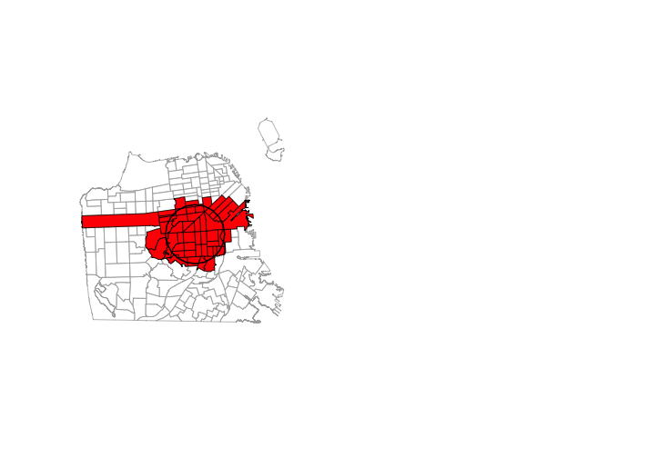

```{r knitr_init, echo=FALSE, cache=FALSE, message=FALSE,results="hide"}
library(knitr)
library(rmdformats)
## Global options
options(max.print="75")
opts_chunk$set(echo=TRUE,
	             cache=TRUE,
               prompt=FALSE,
               tidy=TRUE,
               comment=NA,
               message=FALSE,
               warning=FALSE)
opts_knit$set(width=75)

library(rgdal)
library(sp)
library(rgeos)
library(plyr)
library(raster)

census.tracts<-readOGR("RGIS2_Data",'sf_incomes')
food.trucks<-readOGR("RGIS2_Data",'sf_foodtrucks')
newcrs<-CRS(proj4string(census.tracts))
food.trucks.newproj <- spTransform(food.trucks, newcrs)

```

***

When working with spatial data, one is rarely interested in working with only one source of data. This tutorial will introduce a set of tools for linking vector data with other data sources. It begins by introducing how to link spatial vector data with non-spatial data from in table format, then turns to the problem of linking multiple sources of spatial data through spatial joins and intersects. 

This tutorial uses the `sp`, `rgdal`, and `raster` libraries from the `RGIS1` tutorial. If you have not yet installed those, please revisit that tutorial for directions. In addition, this tutorial will also make use of the `rgeos` library, installation of which is discussed in `part0_setup`. 

***

# 1.Spatial* + Non-Spatial

An attribute join combines tabular data with a Spatial* object by associating each observation in a table with a GIS object (a polygon, line, or point). If you have done attribute joins of shapefiles in GIS software like _ArcGIS_ or _QGis_, or merged two datasets in _Stata_ or _R_, this process is analogous -- in an Attribute Join, a `Spatial*Dataframe` (be that a `SpatialPolygonsDataFrame`, `SpatialPointsDataFrame`, or `SpatialLinesDataFrame`) is merged with a table (an R dataframe) using a common _unique identifier_. 

Assume we have:

* a `SpatialPolygons` object named _worldCountries_, and
* a dataframe called _countryData_ with the attribute data to join

where:

* _"id-number"_ is the colum that contains the unique identifier in _worldCountries_, and 
* _"countryID"_ is the column that contains the unique identifier in _countryData_. 

Then we can just merge worldCountries@data with countryData on those variables, with one small nuance: 

**DO NOT MERGE YOUR DATA USING THE `merge` COMMAND!** 

R keeps track of the relationship between rows in the attribute table an `Spatial*` shapes based on the order of observations in the attribute table. Unfortunately, the `merge` command can shuffle the order of rows in the attribute table, potentially jumbling the association of rows with Point/Line/Polygons.

To avoid this problem, always use two rules when merging:
* Use `join` from the `plyr` library with the `type="left"` argument
* Also place the DataFrame associated with your `Spatial*` object in the first position. 

In this case, that means our merge would look like the following:
```{r eval=FALSE, tidy=FALSE}
library(plyr)
worldCountries@data <- join(worldCountries@data, countryData, by = c("id-number" = "countryID"), type = "left")
```

(FYI: `type="left"` is the same as using the `all.x=TRUE`  and `all.y=FALSE` options for `merge` -- it keeps all rows of the DataFrame in the first position and only matching rows of the second.)

That's it!

***

### Exercise 1

#. Download and unzip the `RGIS2_Data` folder. 

#. Load the CSV table `PhillyEducAttainment.csv` from the data loaded above into a dataframe in R and name it `education`.

#. Load the shapefile `PhillyTotalPopHHinc` from the folder `philly`. 

#. Check out the column names of `philly` and and of `education` to determine which one might contain the unique identifier for the join. Hint: use the `names()` command.

#. Join the `education` data frame with `philly` using `merge` as described above. Use the `names()` command to see if the join was successful.

#. Now we could plot one of the variables we just joined - but be aware that a choropleth map of the total number of the female population per census tract with a Bachelor's degree is rather meaningless. 

```{r eval=FALSE}
spplot (philly, "JN9E032")
```

***

# 2. Spatial* + Spatial*

Combining different Spatial* data sources is one of the most common things you will do in GIS research. Consider the following examples: 

* You have a SpatialPoints file of households in India, and a SpatialPolygons file of Indian state borders. How do you estimate the average income of households in each state? 
* You have a SpatialPoints file of government projects in the US and a SpatialPolygons file of electoral constituencies. Do elected officials with more projects in their district have higher rates of re-election?

Most of the time, you answer these questions using some form of Spatial Join. Unlike the "Attribute Joins" described above, a spatial join in your first purely spatial operation. In a spatial join, observations from different datasets are joined based not on a variable, but by their relationship in space.

## 2.1 Managing Coordinate Reference Systems (CRS)
To combine two Spatial* datasets, the first thing you have to do is make sure they have the same CRS. If you try and work with two Spatial* objects in R that are not in the same CRS, you *will* get results, but those results will be nonsense! **Note that this is very different from programs like ArcGIS that will take care of this problem for you!** So before we can join Spatial* objects, we need to learn to re-project different data sources into a common CRS. 

Make sure you remember the differences between *defining* a CRS and re-projecting:

* **Defining a projection** is when the user tells the computer how it should *interpret* the x-y coordinates associated with a `Spatial*` object. For example, if data comes from a GPS device, one must tell the computer those x-y coordinates are latitudes and longitudes. It does not change the values of the numbers, just how the computer interprets them. 
* **Re-projecting** is when you tell the computer to *convert* coordinates from one representation (like latitude and longitude) to another (like meters from some fixed reference point). It changes not just the `proj4string` associated with an object, but also all the actual x-y coordinates.  

Re-projecting vector data requires two tools, both in the `sp` package:

* a Coordinate Reference System `CRS` object with the new CRS you wish to apply
* the `spTransform()` function

As previously noted, a CRS object includes all the information needed to project a spatial object, generally including both a Geographic Coordinate System (the model of the Earth used to create the data) and a projection (a way of converting points on the three-dimensional Earth onto a two-dimensional plane).

The CRS() function has access to a large library of coordinate systems and transformations, so you just need to know the code for the CRS you want. Codes -- often called a "projection strings" -- can be found [online here](http://www.spatialreference.org).

Once you've found the projection you want, you can create the appropriate CRS object using one of two codes -- the `proj4` string, or the `EPSG` code. These are equivalent, but look a little different.  

For example, you can create a CRS object for [UTM zone 33N (EPSG:32633)](http://spatialreference.org/ref/epsg/wgs-84-utm-zone-33n/) by either passing the full proj4 code:

```{r eval=FALSE}
MyNewProjection <- CRS("+proj=utm +zone=33 +ellps=WGS84 +datum=WGS84 +units=m +no_defs")
```

or the EPSG code:

```{r eval=FALSE}
MyNewProjection <- CRS("+init=EPSG:32633")
```

Once you've defined a `CRS` object with the new CRS you want to use, all you have to do is execute the `spTransform` function on the object you want to re-project. If, for example, we have an object called MyCity and we want to reproject this into a new CRS called MyNewCRS, we would type:

```{r eval=FALSE}
MyNewCRS <- CRS("definition of projection goes here as string")
MyCity.reprojected <- spTransform(MyCity, MyNewCRS)
```

Note that you can also retrieve the CRS from an existing `Spatial*` object with the `proj4string()` command! So if you have two files -- `file.a` and `file.b` -- a common idiom for reprojecting `file.b` into the CRS of `file.a` is:

```{r, eval=FALSE}
common.crs <- CRS(proj4string(file.a))
file.b.reprojected <- spTransform(file.b, common.crs)
```


***

### Exercise 2

#. If you haven't already, create a directory `R_Workshop` on your Desktop and unzip `RGIS2_Data` into that folder. 

#. Load the `rgdal`, `sp`, and `plyr` packages.

#. Read in the `sf_incomes` shapefile into R and name it `census.tracts`. 

#. Read the `sf_foodtrucks` shapefile into R and name it `food.trucks`.

#. What is the CRS of `census.tracts`?   What is the CRS of `food.trucks`?

#. Reproject `food.trucks` so it matches the projection of `census.tracts` and assign it to a new object called `food.trucks.newproj`.

#. You can use the `range()` command from the R base package to compare the coordinates before and after reprojection and confirm that you actually have transformed them. `range()` simply returns the _min_ and _max_ value of a vector of numbers that you give it. So you can check with:  
`range(coordinates(food.trucks))`  
and  
`range(coordinates(food.trucks.newproj))`  

#. You can also compare them visually with:  
```{r}
par(mfrow=c(1,2)) 
plot(food.trucks, axes=TRUE)
plot(food.trucks.newproj, axes=TRUE)
```


## 2.2. Simple Spatial Joins Using The `over` Command


They primary tool for doing spatial joins is the `over` command from the `sp` library. 

The exact behavior of `over` depends on the inputs being used, but the basic idea is: "For each item of first position (the SOURCE), `over` returns information about items of second argument (TARGET) that intersect".

For example, if for every food truck (SOURCE) I wanted to get information about their census tract (TARGET), I could run:

```{r}
truck.home.tract <- over(food.trucks.newproj,census.tracts)
head(truck.home.tract)
```

Note that because `census.tract` is a `SpatialPolygonDataFrame`, `over` returned the relevant row of data for each point. If `census.tract` did not have any data, we would just get the index of the intersecting polygon for each truck. We can see this behavior if we use the `geometry()` function to strip away the DataFrame:


```{r}
truck.home.tract.index <- over(food.trucks.newproj,geometry(census.tracts))
head(truck.home.tract.index)
```

A few caveats:
* By default, `over` will return the *first* item in the TARGET that intersects with an item in SOURCE if there are multiple items. 
* `over` cannot handle intersection two `SpatialPolygons`


### Multiple Intersections


By default, when there are multiple TARGET observations that intersect a SOURCE observation, `over` will just return the first one. There are two ways to address this. 

#### Option 1: `returnList`

`over` normally returns a vector, which can only have one item per row. However, if you pass the argument `returnList=TRUE`, `over` will return a named list, where:
* The name for each list entry is the index of the SOURCE observation
* The contents are the indices of all items in the TARGET that intersect the SOURCE observation 

Once you have this list, you can compute on it with tools like `sapply`. 

Here's an example with just indices of intersecting TARGET observations:
```{r}
over(census.tracts,geometry(food.trucks.newproj),returnList=TRUE)[18:22]
```

Here's an example where one gets back the relevant DataFrame rows of intersecting TARGET observations. 
```{r}
over(census.tracts,food.trucks.newproj,returnList=TRUE)[18:19]
```


#### Option 2: `fn`

However, if the second argument has a DataFrame associated with it, it is possible to ask `over` to aggregate the variables associated with intersecting TARGET observations. 

For example, we can use this to count the number of food trucks in each census tract by: 
* adding a column of 1s to our food truck data called `counter` 
* ask `over` to `sum` the `counter` column for observations that intersect each SOURCE observation. 

```{r}
food.trucks.newproj@data$counter<-1
num.food.trucks <- over(census.tracts,food.trucks.newproj[,'counter'], fn=sum)
head(num.food.trucks,12)
```

If we had other information on food trucks -- like their value -- we could also ask for things like their mean value by passing the `mean` function. 


## 2.3. Fancy Joins and Geometric Operations with `rgeos`

The `over` command will cover a remarkable number of situations, but it falls short in two areas. First, it only looks at whether things are at exact same point in space, and second, it can't merge two `SpatialPolygons` objects. 

When we want to do fancer geometric operations, we use the `rgeos` library. `rgeos` (which stands for "R interface to the *Geometry Engine - Open Source* library") is a set of tools for geometric operations. `GEOS` a huge library, and one that underlies many spatial tools (not just in R). Whenever you're thinking about a geometric operation, `rgeos` is the first place to look. Most commonly:

* If you have a SpatialPoints object and want to create a SpatialPolygon where each polygon contains all points within a given distance of a point, you can use the `gBuffer` tool.
* If you want to see if two SpatialPolygon's intersect, you can use the `gIntersects` tool. 

### Exercise 3

Our goal is to select all SF census tracts that fall within a range of 2 kilometers of Bi-Rite Ice Cream. 

> Think about this for a moment -- what might be the steps you'd follow?

Here is one, but not the only way to do this.

#. Get the polygons
#. Find the city center coordinates
#. Create a buffer around the center
#. Select all polys that fall in the buffer

Let's do it! 

#. Get the polygons.  
Got those.  
We will reuse `sf` for the census tract polygons.

#. Find the city center coordinates.  
Ok. I will tell you: Lat is 37.761518, and Lon is -122.425930. (There also is a convenient `geocode()` function in the `ggmap` package. We will deal with that package in the next section.)  
With this information, create a `SpatialPoints` object named `birite`.  

#. Create a buffer around the center.  
Here is where we will use the `gBuffer()` function from the `rgeos` package. The function can take a number of arguments, but for this purpose we will only need two: the __sp object__ and the __width__ of the buffer, which is assumed to be in map units. The function returns a `SpatialPolygons` object to you with the buffer - name it `birite.buf`.  
So your command would look something like  
```
birite.buf <- gBuffer(the_spatial_point_object, width = a_number_here)
```  
Now -- __before you create this buffer__, think about what you might need to do to `birite` before you proceed.

#. Select all polys that fall in the buffer.  
We will use the `gIntersects()` function from the `rgeos` package for this. The function tests if two geometries (let's name them _spgeom1_ and _spgeom2_) have points in common or not. `gIntersects` returns TRUE if _spgeom1_ and _spgeom2_ have at least one point in common.  
Here is where we determine if the census tracts fall within the buffer. In addition to our two sp objects (`ph.buf` and `philly`) we need to provide one mor argument, `byid`. It is a logical vector determining if the function should be applied across ids (TRUE) or the entire object (FALSE) for _spgeom1_ and _spgeom2_. The default setting is FALSE. Since we want to compare every single census tract polygon in our `philly` object we need to set it to TRUE.  
So your command would be    
```
sf.intersects <- gIntersects (birite.buf, sf, byid=TRUE)
```  
Now we can use the values returned by this function to select the polygons. (Note that `gIntersects()` returns a matrix, and we need a vector for the subsetting, so we can simply use `as.vector()` to coerce the matrix into a vector.)  
`sf.selection <- sf[as.vector(sf.intersects),]`

#. Look at it:  
```
plot (sf, border="#aaaaaa")
plot (sf.selection, add=T, col="red") 
plot (sf.buf, add=T, lwd = 2)
```


***

**Answers to Exercise 3**


```{r eval=FALSE}
library(rgeos)

ctr.coords <- data.frame(x = -75.16522, y = 39.95258) # set the coordinates
prj <- CRS("+proj=longlat +ellps=WGS84 +datum=WGS84 +no_defs") # set the projection
birite <- SpatialPoints(ctr.coords, proj4string = prj) # create the spatialPoints

birite <- spTransform(birite, sf@proj4string) # reproject!!

birite.buf <- gBuffer(birite, width=6562)  # create buffer around center -- note this projection uses FEET as units, so 2 km is 6562 feet!

sf.intersects <-  gIntersects (birite.buf, sf, byid=TRUE) # determine which census tracts intersect with the buffer

sf.selection <- philly[as.vector(sf.intersects),]

plot (sf, border="#aaaaaa")
plot (sf.selection, add=T, col="red") 
plot (birite.buf, add=T, lwd = 2)

````




