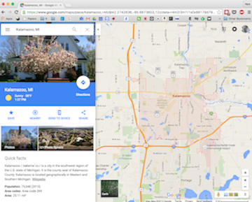
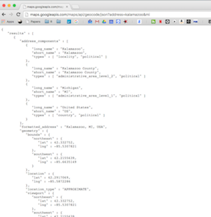

```{r knitr_init, echo=FALSE, cache=FALSE, message=FALSE,results="hide"}
library(knitr)
library(rmdformats)
## Global options
options(max.print="75")
opts_chunk$set(echo=TRUE,
	             cache=TRUE,
               prompt=FALSE,
               tidy=TRUE,
               comment=NA,
               message=FALSE,
               warning=FALSE)
opts_knit$set(width=75)


```

***

This tutorial provides an overview of tools for geocoding -- converting addresses or names of locations into latitudes and longitudes -- using the google maps API. Supplementary information is also provided below on what "API" actually means for those interested in a little demystification of this term, although it is not central to the tutorial. 

***


# 1. Geo-coding with Google Maps

Google offers a service that allows users to submit requests for the latitudes and longitudes associated with different addresses or place names from within R and to get back results that are easy to work within R. This service is called a google geocoding API (Section 2 below discusses what an API is in general terms).  

Basically, the google maps API will accept any query you could type into Google Maps and returns information on Google's best guess for the latitude and longitude associated with your query. The tool for doing this from within R is found int he `ggmap` library, and the basic syntax is as follows: 


```{r}
library(ggmap)

addresses <- c("1600 Pennsylvania NW, Washington, DC", "denver, co")

locations <- geocode(addresses, source="google", output = "more")
locations
```

Note the `output` option can be set to "latlon", "latlona", "more", or "all" depending on how much information you want back. I would **STRONGLY** recommend always using the `output="more"` option so that you get information on how certain google is about its guess!

## 1.1 Interpreting `geocode` results

Geocoding results include two fields that are **very** important to understand: `loctype` and `type`. 

### type

Google thinks of the world as containing a number of different types of locations. Some are points (like houses), while others are areas (like cities). The `type` field tells you if google is giving you the location of a house, or just the centroid of a city. [A full list of different types is available from google here](https://developers.google.com/maps/documentation/geocoding/intro?csw=1#Types), but the most common results (in my experience) are:

* `street_address`: indicates a precise street address
* `locality`: indicates an incorporated city or town political entity
* `point_of_interest`:  indicates a named point of interest. Typically, these "POI"s are prominent local entities that don't easily fit in another category, such as "Empire State Building" or "Statue of Liberty."
* `administrative_area_level_[SOME NUMBER]`: these "civil entities", where 0 is the country, 1 is the first administrative level below that (in the US, states), 2 is below that (in the US, counties), etc. 

This is important because if you get a locality or administrative area, the latitude and longitude you get it just the centroid of the locality, and you should interpret it as such!

### loctype

The `loctype` column provides similar but distinct information to `type`, including more information about `street_address` results. In order of precision, [the possible values for this field are](https://developers.google.com/maps/documentation/geocoding/intro#results):

* "ROOFTOP" indicates that the returned result is a precise geocode for which we have location information accurate down to street address precision.
* "RANGE_INTERPOLATED" indicates that the returned result reflects an approximation (usually on a road) interpolated between two precise points (such as intersections). Interpolated results are generally returned when rooftop geocodes are unavailable for a street address.
* "GEOMETRIC_CENTER" indicates that the returned result is the geometric center of a result such as a polyline (for example, a street) or polygon (region).
* "APPROXIMATE" indicates that the returned result is approximate. **localities and admin areas have this value!**


## 1.2 Query Limits

Google limits individual (free) users to 2,500 queries per day and 10 queries per second. You can see how many queries you have remaining by typing `geocodeQueryCheck()`. You can also buy [additional requests (up to 100,000 a day) for $0.50 / 1000 requests, and there is a paid subscription service that will provide up to 100,000 requests a day](https://developers.google.com/maps/documentation/geocoding/usage-limits).  

Because of this, it is important that you not test your code on your entire dataset or you'll waste your queries when you're debugging your code! 

***

## Exercise 1

*Solutions at end of tutorial, but no cheating!*

#. Load the `addresses_to_geocode.csv` from the RGIS4_Data folder into a DataFrame using `read.csv()`. 

#. Look at the locations in the data. Which do you think will succeed and which will fail? What types of results do you expect from each? 
    + For non-Stanford users: "Encina Hall" is the building for the political science department at Stanford. Entry 3 (Engina Hall) is mis-spelled. 

#. Geocode the addresses using the `geocode` function. Note that if `read.csv` imported the addresses as a "factor" variable you may have to convert it to a character vector.

#. Did you get latitudes and longitudes for all the addresses?

#. Look at the results for Observation 3, which is mis-spelled. What did google do?

#. Look at the results for Observation 4 (there is no place called "the zz room 123" at Stanford). What did google do? Do you like this behavior or not?

#. Why might you want to take the latitude and longitude for Observation 6 with a grain of salt? 


***


# 2. What is an API?

API is an (uninformative) acronym for "Application Programming Interface". 

It is often the case that a user working in one programming environment (like R) would like to take advantage of tools written in a different language. The goal of an API is to facilitate this by acting like as a cross between a translator and a messenger between two different programs.

Let's us an example of an API that you are already quite familiar with, even if you didn't realize it. The `rgeos` library from the RGIS2 tutorial is actually just an API for a program called GEOS written in a language called C++. When people started realizing that they wanted to do GIS analysis in R, the realized that it didn't make sense to write a whole new set of tools in R for geometric operations when there was already a really sophisticated program written for this exact purpose. At the same time, however, they didn't want to require R users to export their data to the harddrive, open a different program in a language they might not know, use that program to execute a calculation, then re-import the data. 

In steps the API, `rgeos`. When you use `rgeos`, here's what's really happening:

* You tell `rgeos` -- in R -- what you would like to happen and give it the data you want to manipulate, 
* `rgeos` translates those commands into commands that `GEOS` can understand,
* `rgeos` converts your data to data that `GEOS` can use.
* `GEOS` then does its analysis, and gives the results to `rgeos`. 
* `rgeos` then converts those results back to R data, and gives it back to you!

That's it. It's just a middle man who "speaks" both R and GEOS, and who's willing to run back and forth between these programs to make your life easier!

(Wanna know a secret? Most good libraries in R are actually just APIs for libraries written in C++!)

## 2.1 What is a Web API?

A web API is just a special kind of API that stands between an internet browser and the servers of a company like Google or Twitter. It's job is to accept requests for data written in HTML, convert them into whatever language a company's servers use, get the result requested, and return it to the user in a format that's easy to work with (usually something called JSON). 

This last point is key -- most of the time, what a Web API does is take a web-page you are familiar with (like google maps) and strip away everything that is distracting to a computer program, like nice pictures and fancy formatting.

### Web-API Requests

The way your computer accesses information on the internet is by composing a request in the form of a web address, known formally as a URL. Most of the time, however, this happens without you know it. For example, if you type "42" into google and click search, the result just appears. But look in the address bar above, and you can see the exact code used to get you those search results, which is sometimes as simple as `https://www.google.com/#q=42` (though, depending on your computer, it may be much longer). Basically, when you click buttons in your browser, the browser converts your clicks into a URL and sends that request out to the internet. 

With a Web API, we skip the step where a user clicks a button in the browser with their mouse, and instead just create customized URLs to ask for the data we need. This is a little less intuitive for humans, but is much easier for computers. 

**URL Components**

There are a couple specific components of most URLs, and understanding these components will be helpful for both web APIs, and in other situations like web-scraping. For example, consider the following link to a youtube video: [https://www.youtube.com/watch?v=dQw4w9WgXcQ](https://www.youtube.com/watch?v=dQw4w9WgXcQ).

* **https** : This is the protocol you're saying you want to use to talk to the server. 
* **www.youtube.com** : This is the server you want to pass your message to. 
* **/watch** : is how you tell the computer the general type of request you're making (in this case, you want to go directly to a video). 
* **?v=dQw4w9WgXcQ** : this is what's called a "Query String". 

Query Strings are how you send extra information to an internet server. They generally start with a `?` or a `#`, and are followed by a number of variable-value pairs. In this case, for example, you're saying that you want youtube to know that in your request, the variable `v` has the value `dQw4w9WgXcQ`" (the internal name for this particular video). 
So basically, this youtube link says: "Hey, Youtube -- I would like to access the program you keep in your `/watch` directory, and when you call that program, please tell it that the variable `v` should be set to `dQw4w9WgXcQ`." 

In this way, a URL is a lot like a function call in R where the query string contains the arguments you are passing to the function!


### Web-API Responses

The main value of a Web API is that the response it provides to a query is written in a stripped-down format that's easy for a computer to understand. Consider the two following results provided by google maps for the search term "Kalamazoo, MI", one through google maps and one through the google maps API:

  

The figure on the left -- the "human-readable" result -- is easy to look at, but consider how hard it would be to tell a computer to zero in on the one piece of data you want and to ignore the map background, the Google Earth button, the photos from Kalamazoo, the various options for modifying the map, etc. 

## 2.2 Google Maps API and `ggmap`

When I said that the google maps API allows users to make queries to google from R, I was actually oversimplifying. The google geocoding API operates by responding to specially crafted URLs with nicely formatted outputs. The `geocode` command in `ggmap` is actually **an API to the google API** that does the work of converting your query into a URL, sending the URL to the google API, getting the results back, and converting them into an R DataFrame. 

This, as it turns out, is really common -- people often build APIs on top of APIs. Google, in writing an API that takes requests for data in the form of URL queries and returns results in a generic format (called JSON), is creating a very generalizable platform that can be used from lots of programs. Then other people can build on this for specific applications, like python, R, etc.

## 2.3 Recap of APIs

So, to recap:

* **What is an API?** A tool that allows a user of one program to easily use a different program potentially in a different language. 
* **What is a Web API?** A tool that allows users to make requests for data over the internet through carefully formatted URLs and to get responses that are easy to use, regardless of the system being used to actually manage that data on the server. 
* **What is the `geocode` function in `ggmap`?** It's an API to the google maps API!


***

Solutions to Exercise 1

```{r}
library(ggmap)

addresses <- read.csv("RGIS4_Data/addresses_to_geocode.csv")
addresses$Location <- as.character(addresses$Location)


results <- geocode(addresses$Location, source="google", output="more")

```

4. All but Number 7
5. It pulled a google and made a guess! In this case, it was right, thankfully. 
6. It recognized it couldn't find "the zz room" but that it *could* find Stanford, so it gave the center of Stanford. This is nice in that it tries to provide a best guess, but it's important for the user to check to make sure they don't treat these "approximate" lats and longs as exact!
7. It's just the center of the DC metropolitan area!

<a rel="license" href="http://creativecommons.org/licenses/by-sa/4.0/"></a><br />This work is licensed under a <a rel="license" href="http://creativecommons.org/licenses/by-sa/4.0/">Creative Commons Attribution-ShareAlike 4.0 International License</a>.