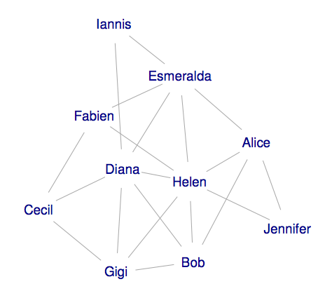
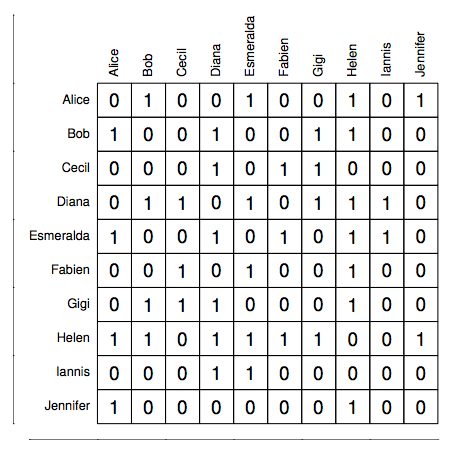
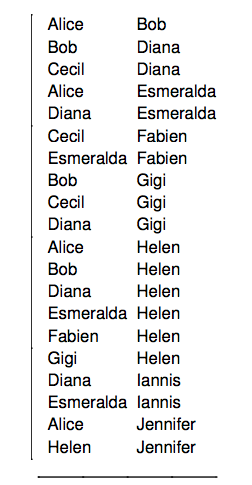

```{r knitr_init, echo=FALSE, cache=FALSE, message=FALSE,results="hide"}
library(knitr)
library(rmdformats)
## Global options
options(max.print="75")
opts_chunk$set(echo=TRUE,
	             cache=TRUE,
               prompt=FALSE,
               tidy=TRUE,
               comment=NA,
               message=FALSE,
               warning=FALSE)
opts_knit$set(width=75)


```

***

This tutorial presents an illustrative example of how network analysis tools -- especially community detection algorithms -- can be combined with geo-spatial tools. For examples of this type of analysis, see:

* “Measuring ‘Neighborhood’: Constructing Network Neighborhoods” by John Hipp, Robert Faris, and Adam Boessen (2012)
* “Redrawing the Map of Great Britain from a Network of Human Interactions" by Carlo Ratti, Stanislav Sobolevsky, Francisco Calabrese, Clio Andris, Jonathan Reades, Mauro Marino, Rob Claxton, and
Steven Strogatz (2010)
* "Ethnicity and Social Networks" by Nick Eubank (forthcoming)


***

# 1. Network Basics

This section provides a brief introduction to network vocabulary, and how networks are represented in computers. 

## 1.1 The Components of a Network

A network -- also sometimes called a *graph* -- is composed of two elements: individual agents, and information on how they relate to one another. More formally, these individuals are known as *vertices* or *nodes*, and relationships between individuals are known as *edges* or *links*. 

Examples of networks abound, and are not limited to the most obvious examples like Facebook social networks (where vertices are individual users and edges exist between people who are "friends"). One can also imagine business networks, where each vertex is a business and edges lie between businesses that buy from one another or share investors. Political actors can also be thought of a network where vertices correspond to individuals and edges are placed between individuals who ahve donated to one another. 


## 1.2 Types of Networks

Though all networks have vertices and edges, the nature of edges can also vary. In particular, edges may be "weighted" or "unweighted", and they can be either "undirected" or "directed". 

### Weighted versus Unweighted

In an unweighted network, individuals are either connected or they are not -- all edges are binary and equal in importance. However, network edges may also be assigned weights that reflect the strength of a connection between individuals. In a business network, for example, one might assign weights based on the total amount of money exchanged between businesses. 

### Directed Versus Undirected

In an undirected graph, all relationships are symmetrical -- if Ali is friends with Beth, then Beth is necessarily friends with Ali. By constrast, in a directed graph, relationships may not be symmetric. For example, in a business network, Business A may buy a product from Business B, but Business B may not have bought products from Business A. 


# 2. Computer Representation of Networks

When we think of networks, we usually have in mind an image like the following:



Unfortunately, while easy for humans to interpret, this type of picture isn't very helpful for computers, so a number of solutions have been developed for network representation. 

## 2.1 Adjacency Matrices

The most common formal presentation of a network is as an **adjacency matrix** -- a matrix that, for `n` individuals, is `n` rows long and `n` rows wide. The cells of this matrix can then be filled in to indicate when individuals are connected -- for an unweighted, undirected network, the cell at row `A` and column `B` will take a value of 1 if `A` and `B` share an edge, and 0 otherwise, as illustrated below:



For undirected networks, this matrix will be symmetric; for weighted networks, these values will correspond to edge weights rather than being 1s and 0s.

## 2.2 Edgelists

Adjacency matrices are very clear, clean representations of networks, but they have on fundamental problem: they quickly become enormous. An adjacency matrix will always be `N` rows long and `N` columns wide, giving rise to `N^2` entries. Even for a moderate size network of 1000 individuals, this matrix will have one million entries, and for a larger network with 100,000 nodes, this number climbs to ten billion. 

Fortunately, there is a more compact way to represent some networks. In most social networks, the majority of individuals are only connected to a few other people, giving rise to what is called a *sparse network*. In *sparse networks*, the vast majority of cells in an adjacency matrix will be occupied with zeros, and so it's actually easier to just write out who is connected to who -- a format called an **edgelist**, as illustrated below:



The interpretation of an edgelist depends on whether it is known to be directed or not -- if a network is directed, then the order in which names appear indicates the direction of connections; if not, order is irrelevant. Weighted networks also often include a third column with the weight associated with each edge.

# 3. The iGraph library

The best tool currently available for analyzing network data in R is the `igraph` library. 

The `igraph` library has a number of advantages over other tools that currently exist. First, it is quite comprehensive -- it includes a tremendous number of tools for very different types of network analysis. Second, despite it's cute name, igraph was written by serious programmers, and it is very fast (as it's actually written in C). This is very important in networks, as many network algorithms are extremely computationally demanding for even moderately sized networks. And finally, it's multi-platform -- you can also use it in Python if you want, and on different computer systems.  

**Note that iGraph released a new version (version 1.0) in June of 2015 which includes a number of substantial changes to the interface ([you can read about them here](http://igraph.org/2015/06/24/igraph-1.0.0-r.html)), so be careful about relying too much on older tutorials.** Old function names should still work thanks to careful work by the project author, but many things have changed. 

Probably the best resource if you want to learn more is a tutorial by the author of iGraph for R (and one of two authors of the underlying C library) [found here.](http://igraph.github.io/netuser15/user-2015.html#1).


## 3.1 Creating a Network Object

The easiest way to create an igraph network is to create an edgelist in a `data.frame`, then convert that `data.frame` into a graph object. 

```{r}
library("igraph")

# Make an edgelist. Normally you might read this from a csv or
# create from other data
edge.list.df <- data.frame(list("col1"=c(1,2,3,3,4), "col2"=c(4,1,2,4,2)))
edge.list.df

# Now convert to a graph!
my.graph <- graph_from_data_frame(edge.list.df, directed=FALSE)

# You can see the vertices:
V(my.graph)

# And edges:
E(my.graph)

# And plot it!
plot(my.graph)

list.graph.attributes(my.graph)

```

## 3.2 iGraph Caveat

One really important trick to iGraph: if you want to access information about a specific vertex, be VERY careful accessing vertices as you would an entry in a vector. **Always use "name" attribute, not id number to access vertices. VERTEX NUMBERS ARE CONTINUOUS AND ALWAYS START AT ZERO**. 

The reason is that vertices are always numbered sequentially starting at zero. If you remove vertices, the other vertices will shift down, so if you have a graph with 5 vertices number 0,1,2,3,4 and drop vertex #3, the vertices will be re-numberd 0,1,2,3. 

## 3.3 Community Detection

There are MANY tools in the iGraph library, and interested parties are strongly encouraged to seek them out. For this tutorial, however, let's just focus on community detection -- assigning individuals to communiites based on who they interact with most. 

```{r}

# Make a simple random graph with 100 nodes and 1000 edges. 
edge.list2 <- data.frame(list("col1"=c(7,2,3,3,4,5,6,7,5), "col2"=c(5,1,2,4,2, 1,1,1,6)))
test.graph <- graph_from_data_frame(edge.list2, directed=FALSE)


# Run the Louvain clustering community detection algorithm 
louvain.result <- cluster_louvain(test.graph, weights = NULL)

# Create data frame with the ids of individuals and their 
# assigned communities
memberships <- membership(louvain.result)
network.result <- as.data.frame(cbind(names(memberships), membership(louvain.result)))
names(network.result) <- c("name", "group_assignment")
network.result

```

That's it! The magic is in making sure you know what these results mean, not in getting the code to work. 

***

## Exercise 1

#. Load the edgelist "airline_travel.csv" in RGIS6_Data using read.csv(). This file contains the total number of passengers passing between US states during 2014 (from the Bureau of Transportation Statistics). The data is for an *undirected* network -- passengers passing from VT to CO have been combined with passengers traveling from CO to VT, for example. 

#. To convert this data into a graph, use the `graph_from_data_frame` command. To do so, first rename the passenger columns "weight" (iGraph looks for that column name to create weighted graphs). 

#. Summarize the network. It should say something like "IGRAPH UNW" which means an iGraph **UN**directed, **W**eighted graph. 

#. Use the `cluster_louvain` command to find the community structure of the graph. 

#. Extract the membership list and put it in a new dataframe. 

***

# 4. Make it Spatial

Once individuals have been assigned to communities, making your network analysis is actually quite straightfoward: just do an attribute join of the memberships you just created with a Spatial* object that contains information on the locations of the network nodes. The communities will then just be an attribute you can plot with `spplot`. 

```{r}
library(sp)

# Make example Spatial* object for join
spatial.data <- data.frame(rbind(c(1.5, 2.00, 1),
                          c(2.5, 2.00, 2),
                          c(0.5, 0.50, 3),
                          c(1.0, 0.25, 4),
                          c(2, 1, 5),
                          c(2.0, 0.5, 6),
                          c(1, 0.00, 7)
                         ))
names(spatial.data) <- c("x", "y", "name")
coordinates(spatial.data) <- c("x", "y")
plot(spatial.data)

# Merge in memberships
library(plyr)
spatial.data@data <- join(spatial.data@data, network.result, by ="name", type = "left")
my.palette <- c("red", "blue")

spplot(spatial.data, "group_assignment", col.regions=my.palette, cex=3, cuts=2)
```

***

## Exercise 2

#. Import the state shapefile in RGIS6_Data/state_shapefile. 

#. Do an attribute join to merge your air-travel communities with polygons. 

#. Plot your communities! You may need to reproject / drop protectorates to visualize clearly. 

***


**Solutions**

```{r add_spatial}
library(rgdal)
library(sp)
library(igraph)

# Exercise 1: Make communities
air <- read.csv('RGIS6_data/airline_travel.csv')
names(air) <- c('in', 'out', 'weight')
graph <- graph_from_data_frame(air, directed=FALSE)
communities <- cluster_louvain(graph)
membership.vector <- membership(communities)
result <- as.data.frame(cbind(names(membership.vector), membership.vector))
names(result) <- c("STUSPS", "community")


# Exercise 2:

# Clean up states
states <- readOGR(dsn="RGIS6_data/state_shapefile", layer="states")
states <- states[as.numeric(as.character(states@data$STATEFP)) < 59,]
states <- spTransform(states, CRS("+init=EPSG:5070"))

# Merge
library(plyr)
states@data <- join(states@data, result, by = c("STUSPS"), type="left")
```

```{r, echo=FALSE, results=FALSE}
library(rgeos)
states_simplified <- gSimplify(states, 10000)
data.copy <- states@data
rownames(data.copy) <- getSpPPolygonsIDSlots(states) 
states <- SpatialPolygonsDataFrame(states_simplified, data.copy)
```

```{r}
spplot(states, "community")
```

***

<a rel="license" href="http://creativecommons.org/licenses/by-sa/4.0/"></a><br />This work is licensed under a <a rel="license" href="http://creativecommons.org/licenses/by-sa/4.0/">Creative Commons Attribution-ShareAlike 4.0 International License</a>.